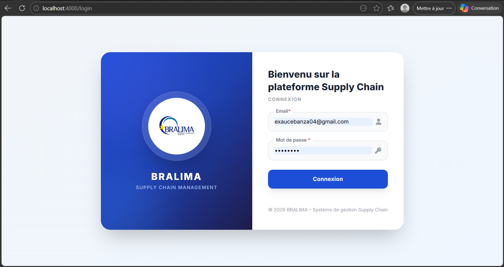
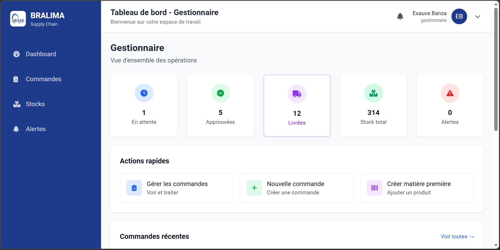
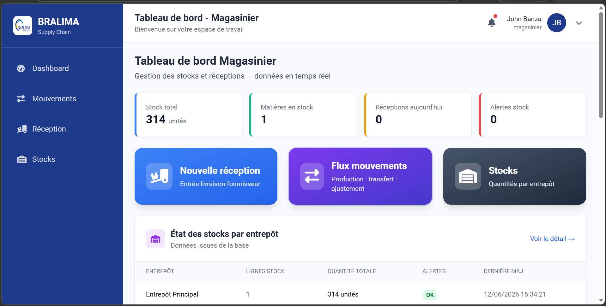
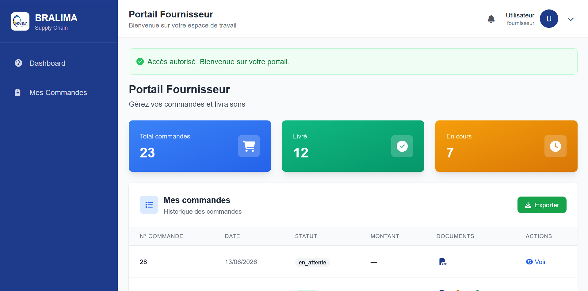
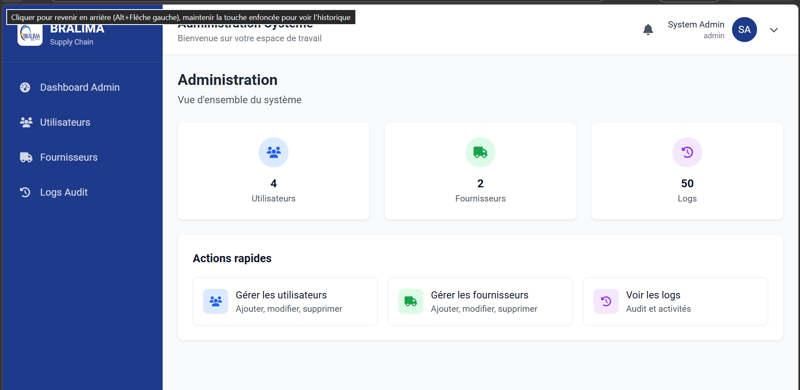

# BRALIMA Supply Chain - Gestion des Matières Premières
> **Projet de Fin d'Études (TFE)** — Solution digitale sécurisée pour la gestion de la chaîne d'approvisionnement des matières premières chez BRALIMA.

---

## 📋 Table des matières
1. [Présentation du Projet](#présentation-du-projet)
2. [Présentation Détaillée des Interfaces](#présentation-détaillée-des-interfaces)
3. [Architecture & Stack Technique](#architecture--stack-technique)
4. [Sécurité & Prévention de la Fraude](#sécurité--prévention-de-la-fraude)
5. [Déploiement Docker (Configuration Faculté)](#déploiement-docker-configuration-faculté)
6. [Installation Locale](#installation-locale)

---

## 🌟 Présentation du Projet
Ce projet propose une solution informatique robuste pour gérer le flux d'approvisionnement des matières premières de la BRALIMA (comme le maïs, le malt, etc.). Il résout les problématiques d'incohérence des stocks, d'opacité des échanges avec les fournisseurs, et élimine les risques de fraudes financières liés à la saisie manuelle des prix lors des commandes d'achat.

---

## 🖥️ Présentation Détaillée des Interfaces

### 1. Page de Connexion Sécurisée


* **Rôle & Utilité** : Point d'accès unique à l'application. Cette interface identifie l'utilisateur et détermine dynamiquement son rôle (Administrateur, Gestionnaire, Magasinier, Fournisseur) pour le rediriger vers son espace de travail dédié.
* **Aspects Techniques & Sécurité** :
  * **Hachage Bcrypt** : Les mots de passe saisis sont comparés à des empreintes sécurisées hachées en `bcrypt`.
  * **Gestion de Session** : Utilisation de cookies sécurisés (`express-session`) avec protection contre le vol de session.
  * **Protection Helmet** : Headers HTTP sécurisés pour prévenir les attaques XSS (injection de scripts) et de détournement de clics.

---

### 2. Tableau de Bord Gestionnaire (Orchestrateur Supply Chain)


* **Rôle & Utilité** : C'est le centre décisionnel de l'application. Il permet au gestionnaire d'avoir une visibilité en temps réel sur les stocks, de suivre les commandes en cours et de visualiser les alertes prédictives.
* **Fonctionnalités Clés** :
  * **Alertes Prédictives** : Des voyants colorés signalent immédiatement les matières premières dont le stock est inférieur au seuil d'alerte ou critique.
  * **Création de Commande sans Fraude** : Lors de la création d'une commande, le gestionnaire choisit un fournisseur, et les matières premières qu'il propose ainsi que leur prix au kilo (déjà négociés et enregistrés) se remplissent automatiquement. **La saisie manuelle du prix est verrouillée** pour empêcher toute fraude ou erreur humaine.

---

### 3. Tableau de Bord Magasinier (Gestion Physique des Stocks)


* **Rôle & Utilité** : Cette interface sert aux équipes sur le terrain (dépôts de stockage) pour enregistrer les entrées et sorties de matières premières.
* **Fonctionnalités Clés** :
  * **Réception de Marchandise** : Le magasinier confirme l'arrivée physique des matières premières, saisit le numéro de lot, la date de péremption, et la zone de stockage.
  * **Traçabilité des Flux** : Chaque mouvement de stock (entrée pour livraison, sortie pour la production, ajustement de stock) est consigné avec précision dans un historique non modifiable.
  * **Scan Code-barres** : Intégration d'un module de scan (via webcam ou mobile) pour identifier rapidement les lots.

---

### 4. Portail Fournisseur (Espace Partenaire Externe)


* **Rôle & Utilité** : Permet aux fournisseurs externes (ex: Malteries) de voir les commandes que la BRALIMA leur a adressées, d'accepter une commande, d'éditer un bon de livraison et de confirmer l'expédition.
* **Fonctionnalités Clés** :
  * **Accès Sécurisé par Magic Link** : Le fournisseur reçoit un e-mail automatique contenant un lien d'accès unique temporaire. Il n'a pas besoin de mémoriser un mot de passe complexe, et ce jeton est à usage unique strict.
  * **Génération de Documents PDF** : Génération dynamique des Bons de Commande, Bons de Livraison et Bons de Transport au format PDF professionnel, téléchargeables directement.

---

### 5. Espace Administrateur (Sécurité, IAM & Audit)


* **Rôle & Utilité** : Interface réservée au gestionnaire informatique de l'application pour superviser le système, gérer les comptes utilisateurs et inspecter la sécurité.
* **Fonctionnalités Clés** :
  * **Gestion IAM (Identity and Access Management)** : Création, modification, suspension ou suppression de comptes utilisateurs avec affectation stricte de rôles.
  * **Registre d'Audit Logs (LogAudit)** : Historique complet, immuable et horodaté de toutes les actions sensibles effectuées sur l'application (qui s'est connecté, quelle commande a été approuvée, quel compte a été modifié, avec l'adresse IP associée). Essentiel pour la transparence et les audits de sécurité.

---

## 🛠️ Architecture & Stack Technique

L'application est structurée selon l'architecture **MVC (Modèle-Vue-Contrôleur)** pour assurer une séparation stricte des responsabilités :
* **Modèles (`/models`)** : Requêtes SQL optimisées pour interagir avec la base de données.
* **Vues (`/views`)** : Pages dynamiques écrites en HTML / EJS et stylisées avec TailwindCSS.
* **Contrôleurs (`/controllers`)** : Logique métier en Node.js (calculs, validations, envois d'e-mails).
* **Routes (`/route`)** : Aiguillage des requêtes HTTP vers les bons contrôleurs.

---

## 🔒 Sécurité & Prévention de la Fraude

* **Double Validation Serveur** : Le calcul des totaux de commandes est effectué côté serveur. Toute tentative de modification du prix unitaire par un utilisateur dans le navigateur est détectée et rejetée par le back-end.
* **Audit permanent** : Intégration de la table `logaudit` qui trace chaque action (CREATE, UPDATE, DELETE, LOGIN).
* **Prévention des attaques** : Helmet.js configure automatiquement des en-têtes HTTP de sécurité contre le clickjacking et le sniffing de contenu MIME.

---

## 🐳 Déploiement Docker (Configuration Faculté)

Afin d'éviter tout conflit de configuration avec les autres projets déployés sur le serveur partagé **Contabo** (une seule adresse IP pour plusieurs étudiants), le projet utilise **Docker Compose** pour isoler complètement l'application et sa base de données.

### Fichiers de configuration inclus :
* **`Dockerfile`** : Construit une image optimisée sous Alpine Linux avec Node.js 20 en mode production.
* **`docker-compose.yml`** : Orchestre l'application Node et la base de données MySQL.
  * **Ports mappés uniques** :
    * Web : **`8002`** (externe) ➔ `8000` (interne)
    * MySQL : **`3309`** (externe) ➔ `3306` (interne)
  * **Initialisation automatique de la BD** : Le fichier [`gestionstocks.sql`](gestionstocks.sql) est monté dans `/docker-entrypoint-initdb.d/` pour importer automatiquement les tables et données initiales au premier démarrage.

---

## 🚀 Installation Locale

### Méthode 1 : Avec Docker (Recommandé)
1. Assurez-vous que Docker Desktop est lancé.
2. Démarrez l'application :
   ```bash
   docker compose up -d --build
   ```
3. Accédez à l'application sur **`http://localhost:8002`**.

### Méthode 2 : Sans Docker
1. Installez les dépendances :
   ```bash
   npm install
   ```
2. Configurez votre fichier `.env` avec vos accès MySQL locaux.
3. Exécutez le script d'initialisation de la base de données [`init_complete_database.sql`](init_complete_database.sql) dans votre instance MySQL.
4. Lancez le serveur de développement :
   ```bash
   npm run dev
   ```
5. Accédez à l'application sur **`http://localhost:4000`**.