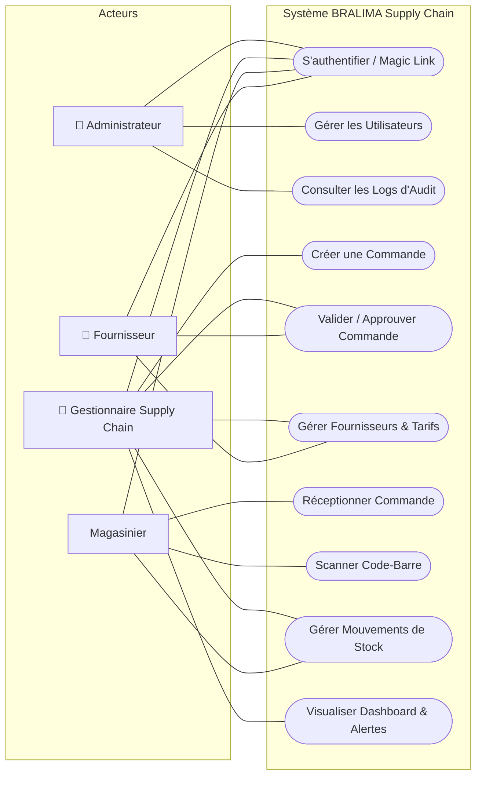
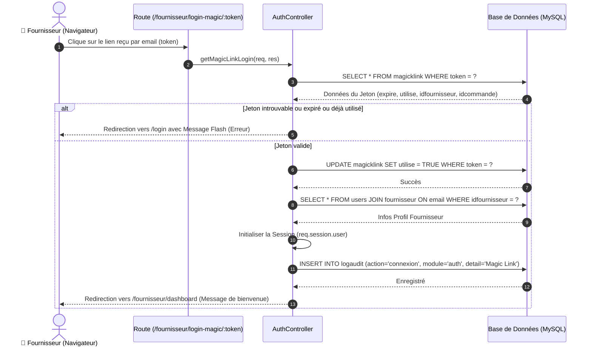
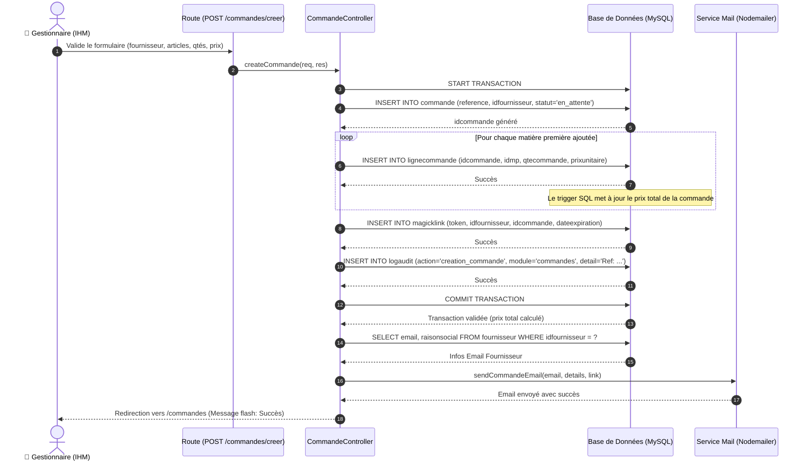
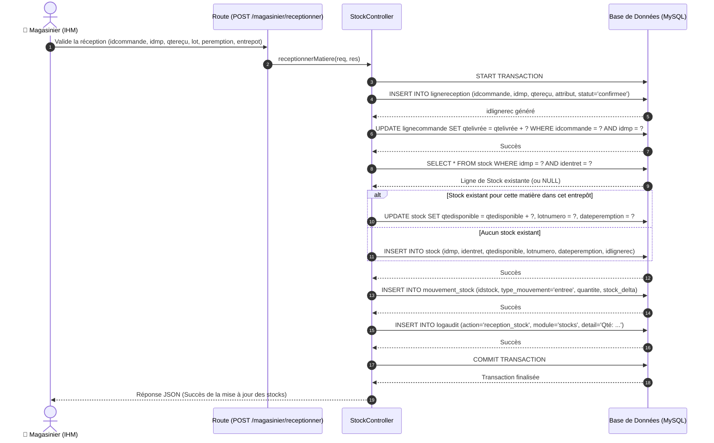
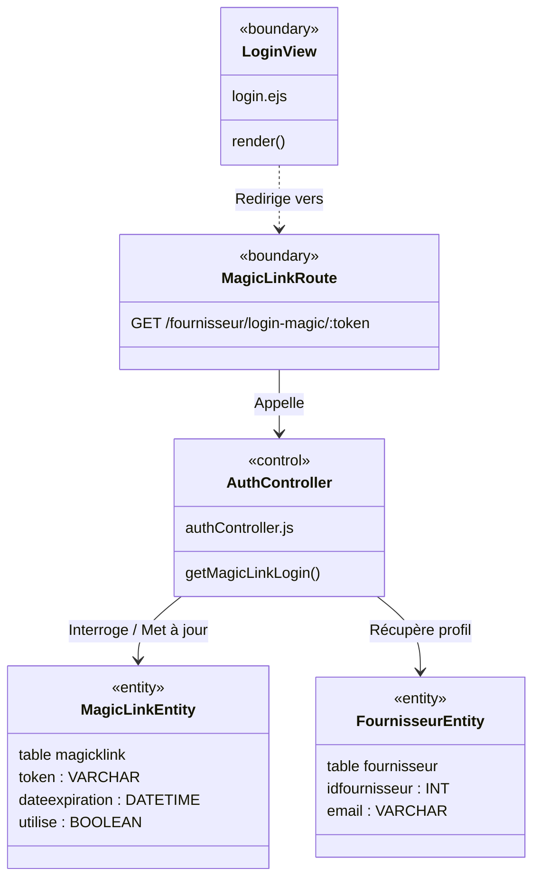
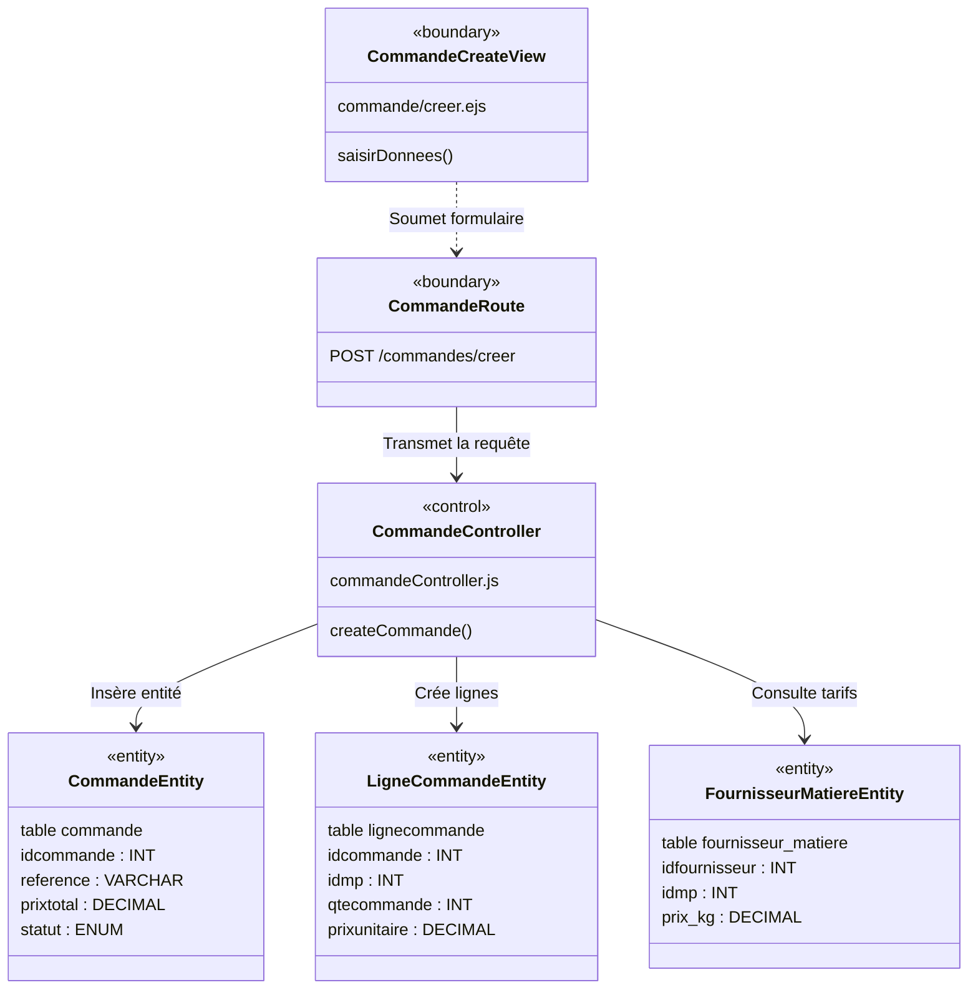
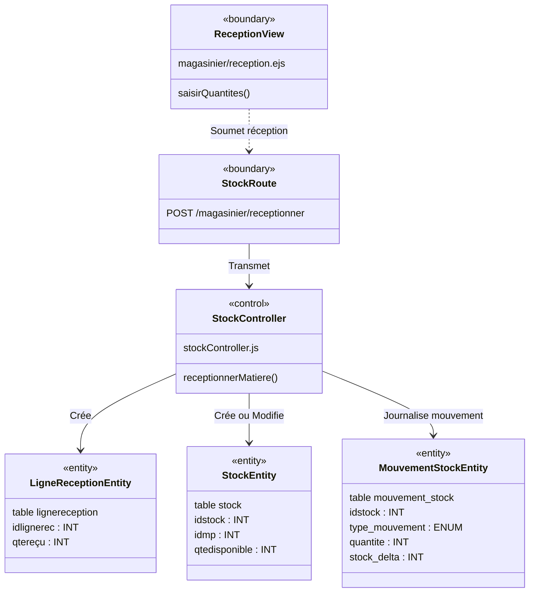
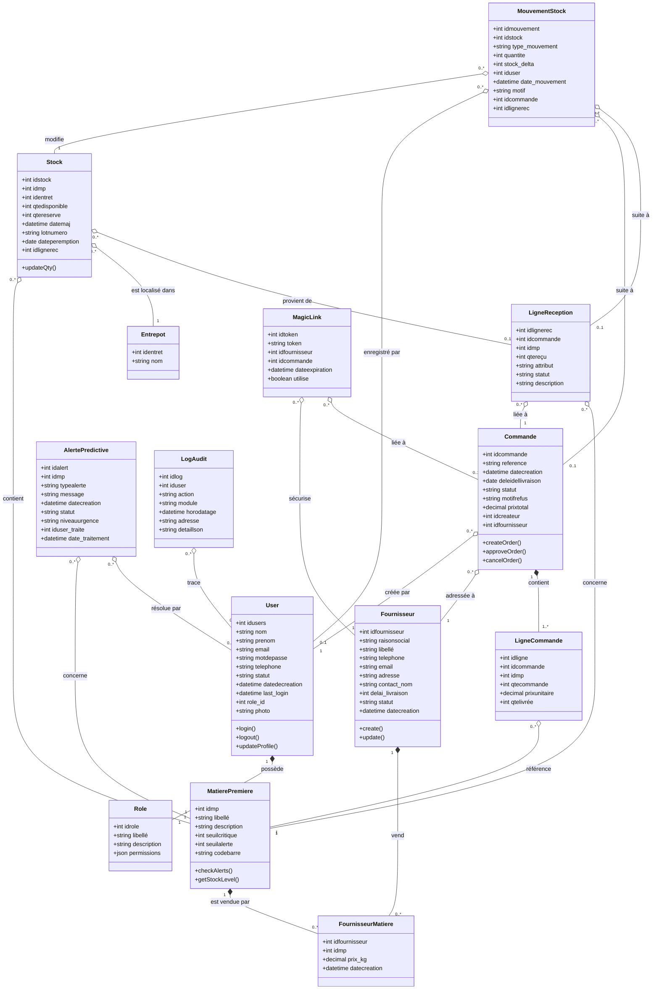
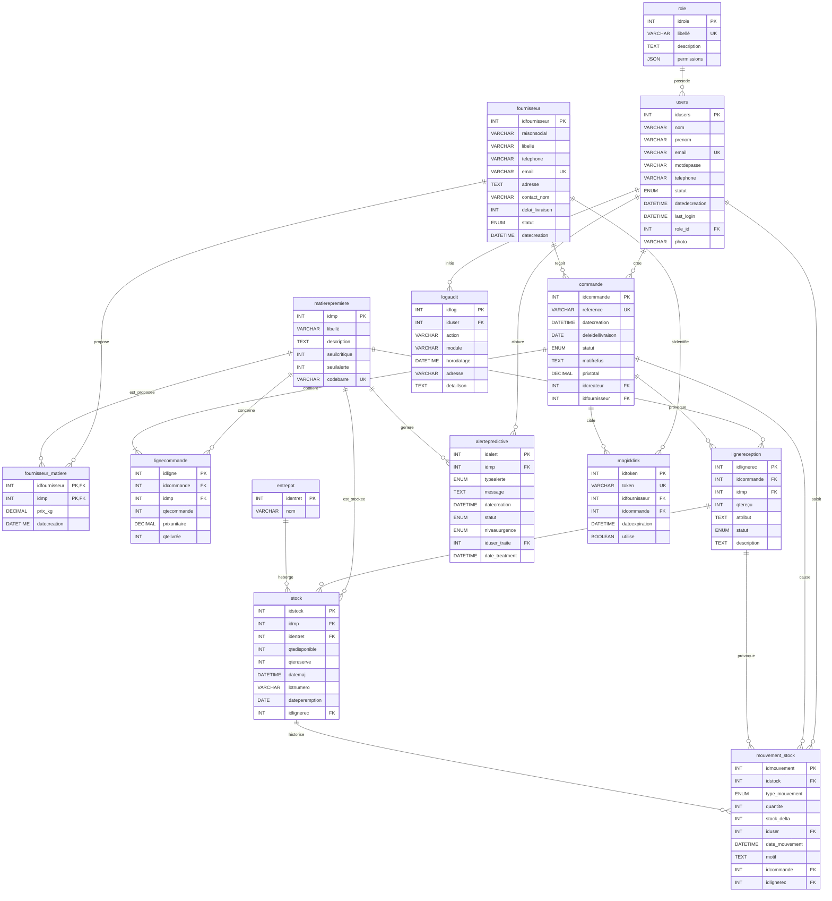

# Rapport d'Analyse et de Conception : BRALIMA Supply Chain
## Gestion Numérique de la Chaîne d'Approvisionnement des Matières Premières

Ce document formalise l'analyse des besoins et la conception technique de la solution de gestion d'approvisionnement des matières premières développée pour la **BRALIMA**. Il sert de base de référence pour comprendre le fonctionnement systémique, les flux de données, l'architecture logicielle (MVC en Node.js/Express) et la structure de la base de données MySQL.

---

## 1. Analyse des Besoins

La solution **BRALIMA Supply Chain** répond au besoin critique de suivi en temps réel des stocks de matières premières (malt, houblon, sucre, étiquettes, capsules, etc.), de la gestion automatisée des commandes d'approvisionnement, de la traçabilité des réceptions, et de l'anticipation des ruptures de stock grâce à des alertes prédictives.

### 1.1. Besoins Fonctionnels par Rôle

Le système intègre une gestion des accès basée sur les rôles (**RBAC**) avec 4 profils utilisateurs distincts :

1. **Gestionnaire Supply Chain (Planificateur / Acheteur)** :
   - Gérer les fiches des fournisseurs et des matières premières.
   - Gérer les tarifs associés (relation fournisseur-matière avec prix au kilo).
   - Créer de nouvelles commandes d'approvisionnement en matières premières.
   - Valider ou rejeter les réceptions déclarées par le magasinier.
   - Consulter le tableau de bord global, suivre l'évolution des stocks et analyser les alertes prédictives (seuil d'alerte, seuil critique, risque de péremption).
   
2. **Magasinier (Opérateur de Terrain)** :
   - Visualiser les commandes approuvées ou en cours de livraison.
   - Réceptionner les livraisons (saisie des quantités réelles reçues, numéro de lot, date de péremption).
   - Utiliser la simulation de scan de code-barre mobile pour identifier rapidement une matière première.
   - Effectuer des mouvements de stock manuels (ajustement, transfert entre entrepôts).

3. **Fournisseur (Partenaire Externe)** :
   - Se connecter de manière sécurisée et simplifiée via un **Magic Link** à usage unique envoyé par e-mail (sans gestion fastidieuse de mot de passe).
   - Consulter l'historique et le détail de ses commandes.
   - Confirmer la prise en charge d'une commande et renseigner la date de livraison prévue.

4. **Administrateur Système (IAM & Audit)** :
   - Gérer les comptes utilisateurs (création, activation, suspension, attribution des rôles).
   - Consulter les logs d'audit (historique des actions critiques : suppression, modification, accès sensibles).
   - Configurer les paramètres globaux de l'application (SMTP, devise, seuils système).

---

## 2. Diagramme de Cas d'Utilisation

Le diagramme de cas d'utilisation synthétise les interactions entre les différents acteurs et le système de gestion des stocks.

---

## 3. Tableau des Itérations

Le développement de l'application a été structuré en 3 itérations principales pour assurer des livraisons incrémentales et fonctionnelles.

| Itération | Objectif / Thème | Fonctionnalités Incluses | Priorité | Livrables associés |
| :--- | :--- | :--- | :--- | :--- |
| **Itération 1** | **Fondations, Sécurité & IAM** | - Configuration de la base de données MySQL - Système d'authentification multi-rôle (Session/Bcrypt) - Gestion des comptes utilisateurs (Admin) - Journalisation des actions (Log d'Audit) | Haute | - Schéma SQL de base - Interfaces de connexion & d'administration - Middleware de contrôle des rôles |
| **Itération 2** | **Gestion des Approvisionnements** | - Création des fiches fournisseurs et matières premières - Association Fournisseurs-Matières (tarification au kg) - Cycle de vie des commandes (En attente, Approuvée, Envoyée, Livrée) - Intégration du système de Magic Link pour les fournisseurs - Notifications emails automatiques (Nodemailer) | Haute | - Module commandes (views/controllers) - Générateur de jetons Magic Link - Intégration SMTP de messagerie |
| **Itération 3** | **Gestion des Réceptions, Stocks & IA** | - Réception des commandes (Magasinier) - Simulation du scan de code-barre mobile - Traçabilité des mouvements de stock (Entrées, sorties, transferts) - Tableau de bord analytique et alertes prédictives (Predictive Alerts) - Tâches de fond planifiées (CronJobs pour vérification des périmés) | Moyenne | - Interface mobile-friendly de scan - Graphiques de stock et calculs de prédiction de rupture - Système d'alertes par e-mail et notifications |

---

## 4. Descriptions Textuelles des Cas d'Utilisation

Voici les descriptions textuelles détaillées pour 3 cas d'utilisation critiques de l'application.

### 4.1. Description Textuelle : Connexion via Magic Link (Fournisseur)

| Propriété | Détail |
| :--- | :--- |
| **Identifiant** | UC-AUTH-02 |
| **Nom** | Authentification sécurisée via Magic Link |
| **Acteurs** | **Fournisseur** (Principal), Serveur SMTP de messagerie (Secondaire) |
| **Préconditions** | 1. Le fournisseur est enregistré dans la base de données avec son e-mail officiel. 2. Une commande d'approvisionnement lui a été adressée par le Gestionnaire. 3. Un email contenant le lien d'accès unique a été envoyé au fournisseur. |
| **Scénario Nominal** | 1. Le fournisseur clique sur le lien d'accès unique reçu par e-mail (`/fournisseur/login-magic/:token`). 2. Le système intercepte la requête HTTP GET. 3. Le système recherche le jeton (token) dans la table `magicklink`. 4. Le système valide que le jeton existe, n'est pas expiré et n'a jamais été utilisé (`utilise = FALSE`). 5. Le système marque le jeton comme utilisé (`utilise = TRUE`). 6. Le système récupère l'identifiant du fournisseur et crée une session utilisateur active. 7. Le système redirige le fournisseur vers son espace dédié (`/fournisseur/dashboard`). |
| **Scénarios Alternatifs** | **4.a. Jeton expiré ou déjà utilisé :** &nbsp;&nbsp;&nbsp;&nbsp;1. Le système détecte que la date d'expiration est dépassée ou que `utilise = TRUE`. &nbsp;&nbsp;&nbsp;&nbsp;2. Le système affiche un message d'erreur sur la page de connexion standard : "Lien de connexion expiré ou invalide". &nbsp;&nbsp;&nbsp;&nbsp;3. La session n'est pas créée. **4.b. Jeton non reconnu :** &nbsp;&nbsp;&nbsp;&nbsp;1. Le jeton n'existe pas en base de données. &nbsp;&nbsp;&nbsp;&nbsp;2. Le système renvoie une erreur 404 ou redirige vers `/login` avec un message d'alerte. |
| **Postconditions** | En cas de succès, le fournisseur accède à son tableau de bord sans mot de passe. Le jeton devient inutilisable pour toute tentative future. |

### 4.2. Description Textuelle : Création d'une Commande d'Approvisionnement

| Propriété | Détail |
| :--- | :--- |
| **Identifiant** | UC-CMD-01 |
| **Nom** | Créer et envoyer une commande de matières premières |
| **Acteurs** | **Gestionnaire Supply Chain** (Principal), Fournisseur (Secondaire) |
| **Préconditions** | 1. Le gestionnaire est connecté à l'application avec un rôle valide. 2. Au moins un fournisseur actif et des matières premières associées existent en base de données. |
| **Scénario Nominal** | 1. Le gestionnaire accède au formulaire de création de commande. 2. Le gestionnaire sélectionne un fournisseur actif. 3. Le système filtre et affiche les matières premières proposées par ce fournisseur avec les prix au kg négociés. 4. Le gestionnaire sélectionne une ou plusieurs matières et saisit la quantité demandée. 5. Le gestionnaire saisit la date de livraison prévue souhaitée et valide la commande. 6. Le système démarre une transaction en base de données. 7. Le système crée un enregistrement dans la table `commande` avec un statut `en_attente` et une référence unique (ex: `CMD-2026-0001`). 8. Le système insère les lignes correspondantes dans `lignecommande`. Le trigger de la base de données calcule automatiquement le coût total cumulé. 9. Le système génère un jeton Magic Link associé à cette commande pour le fournisseur. 10. Le système valide la transaction (Commit) et envoie un e-mail automatique au fournisseur contenant le détail de la commande et son lien de connexion rapide. 11. Le système affiche un message flash de confirmation et redirige vers la liste des commandes. |
| **Scénarios Alternatifs** | **4.a. Quantité saisie invalide :** &nbsp;&nbsp;&nbsp;&nbsp;1. Le gestionnaire saisit une quantité négative ou vide. &nbsp;&nbsp;&nbsp;&nbsp;2. Le système bloque la validation et affiche un message d'erreur d'entrée. **10.a. Échec de l'envoi de l'e-mail :** &nbsp;&nbsp;&nbsp;&nbsp;1. Le serveur SMTP de l'application est indisponible. &nbsp;&nbsp;&nbsp;&nbsp;2. Le système valide tout de même la commande en base, mais affiche un message d'avertissement au gestionnaire : "Commande créée avec succès, mais la notification email n'a pas pu être envoyée". |
| **Postconditions** | La commande est enregistrée avec le statut `en_attente`. Le stock disponible reste inchangé à cette étape. |

### 4.3. Description Textuelle : Réception de Matières Premières par le Magasinier

| Propriété | Détail |
| :--- | :--- |
| **Identifiant** | UC-STOCK-03 |
| **Nom** | Enregistrer la réception physique d'une livraison |
| **Acteurs** | **Magasinier** (Principal), Système de code-barre (Secondaire) |
| **Préconditions** | 1. Le magasinier est authentifié et affecté à un entrepôt spécifique. 2. Une commande d'approvisionnement dans l'état `approuvee` ou `en_cours` (ou `envoyee`) est physiquement arrivée sur le quai de déchargement. |
| **Scénario Nominal** | 1. Le magasinier recherche la commande par sa référence ou scanne le code-barre de la matière livrée. 2. Le système affiche la liste des matières attendues dans cette commande. 3. Pour chaque matière reçue, le magasinier saisit la quantité livrée réelle, le numéro de lot fournisseur et la date de péremption. 4. Le magasinier valide la réception de la matière. 5. Le système initie une transaction SQL : &nbsp;&nbsp;&nbsp;&nbsp;- Insère une ligne dans `lignereception` avec le statut `confirmee`. &nbsp;&nbsp;&nbsp;&nbsp;- Met à jour le champ `qtelivrée` dans la table `lignecommande` correspondante. &nbsp;&nbsp;&nbsp;&nbsp;- Vérifie si une ligne de stock existe déjà pour ce couple (matière, entrepôt) : si oui, ajoute la quantité reçue à `qtedisponible` ; si non, crée un nouvel enregistrement de stock. &nbsp;&nbsp;&nbsp;&nbsp;- Insère une ligne d'historique dans la table `mouvement_stock` avec le type `entree` et la variation positive (`stock_delta = +quantite`). 6. Le système valide la transaction (Commit). 7. Si la totalité des matières commandées a été réceptionnée, le statut global de la commande est mis à jour à `livree`. |
| **Scénarios Alternatifs** | **3.a. Écart de quantité (Livraison partielle ou excédentaire) :** &nbsp;&nbsp;&nbsp;&nbsp;1. La quantité reçue est différente de la quantité commandée. &nbsp;&nbsp;&nbsp;&nbsp;2. Le magasinier valide la quantité réelle. &nbsp;&nbsp;&nbsp;&nbsp;3. La ligne de commande reste marquée comme partiellement livrée, la commande conserve le statut `en_cours`, et le système génère une alerte prédictive de type "Écart de livraison" pour le Gestionnaire. **5.a. Alerte péremption immédiate :** &nbsp;&nbsp;&nbsp;&nbsp;1. La date de péremption saisie est dépassée ou trop proche de la date actuelle. &nbsp;&nbsp;&nbsp;&nbsp;2. Le système bloque la réception ou génère une alerte critique immédiate. |
| **Postconditions** | Les stocks physiques sont mis à jour en temps réel. Un mouvement d'entrée traçable est enregistré. |

---

## 5. Diagrammes de Séquence

Ces diagrammes décrivent l'ordre chronologique des messages échangés entre les différents objets de l'application Node.js pour les 3 cas d'utilisation décrits ci-dessus.

### 5.1. Diagramme de Séquence 1 : Authentification via Magic Link

### 5.2. Diagramme de Séquence 2 : Création d'une Commande d'Approvisionnement

### 5.3. Diagramme de Séquence 3 : Réception d'une Commande (Magasinier)

---

## 6. Diagrammes de Classe Participantes (MVC / VCE)

Le modèle **Vue-Contrôle-Entité (VCE)** ou Robustesse sépare les classes participantes selon trois stéréotypes :
- **Boundary (Vue / Route)** : Représente les interfaces et les points d'entrée d'URL.
- **Control (Contrôleur)** : Orchestre la logique métier et fait le lien.
- **Entity (Modèle de données)** : Représente les entités persistantes en base de données.

### 6.1. Cas d'utilisation 1 : Authentification Magic Link

### 6.2. Cas d'utilisation 2 : Création de Commande

### 6.3. Cas d'utilisation 3 : Réception de Stock

---

## 7. Diagramme de Classe Global

Le diagramme ci-dessous représente le domaine conceptuel complet de l'application, décrivant la structure des données avec leurs attributs, méthodes principales et cardinalités de relations.

---

## 8. Schéma Physique de la Base de Données

Le schéma de la base de données (modèle physique) formalise les tables MySQL réelles, leurs clés primaires, clés étrangères et les contraintes définies.

### 8.1. Schéma Entité-Association (ERD)

### 8.2. Description des Tables du Schéma

1. **role** : Contient la liste des rôles applicatifs (`admin`, `gestionnaire`, `fournisseur`, `magasinier`) et leurs configurations de permissions JSON associées.
2. **users** : Contient tous les utilisateurs internes, liés à leur rôle respectif.
3. **fournisseur** : Stocke les coordonnées des partenaires de la BRALIMA ainsi que leurs conditions de livraison.
4. **matierepremiere** : Fiches articles des matières premières avec seuils de réapprovisionnement.
5. **fournisseur_matiere** : Table de jointure avec attribut de prix. Détermine le catalogue de prix unitaire négocié par fournisseur pour chaque matière première.
6. **commande** : Entête de commande d'approvisionnement avec état de flux (`en_attente`, `approuvee`, `refusee`, `annulee`, `en_cours`, `envoyee`, `livree`).
7. **lignecommande** : Lignes d'articles rattachées à une commande, contenant les quantités prévues et livrées à date.
8. **lignereception** : Trace les livraisons physiques validées par les magasiniers.
9. **entrepot** : Entrepôts physiques de stockage (ex: "Entrepôt malt", "Cuves liquides").
10. **stock** : État actuel du stock disponible et réservé par matière première et entrepôt, avec traçabilité de lot/péremption.
11. **mouvement_stock** : Journal immuable des variations de stock (`entree`, `sortie`, `transfert`, `ajustement`) avec calcul de `stock_delta` signé pour les bilans de consommation.
12. **alertepredictive** : Alertes générées automatiquement pour anticiper les anomalies de stock ou de logistique.
13. **magicklink** : Table de stockage des jetons de connexion éphémères pour les fournisseurs tiers.
14. **logaudit** : Journal de sécurité recueillant les requêtes sensibles et actions d'administration.

---
> [!NOTE]
> **Trigger de Base de Données actif** : Un déclencheur MySQL (`update_commande_total`) est configuré pour recalculer automatiquement le `prixtotal` d'une commande à chaque fois qu'une ligne est insérée dans la table `lignecommande`.
