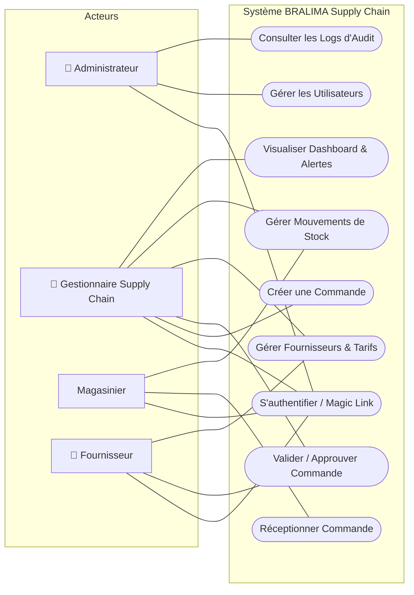
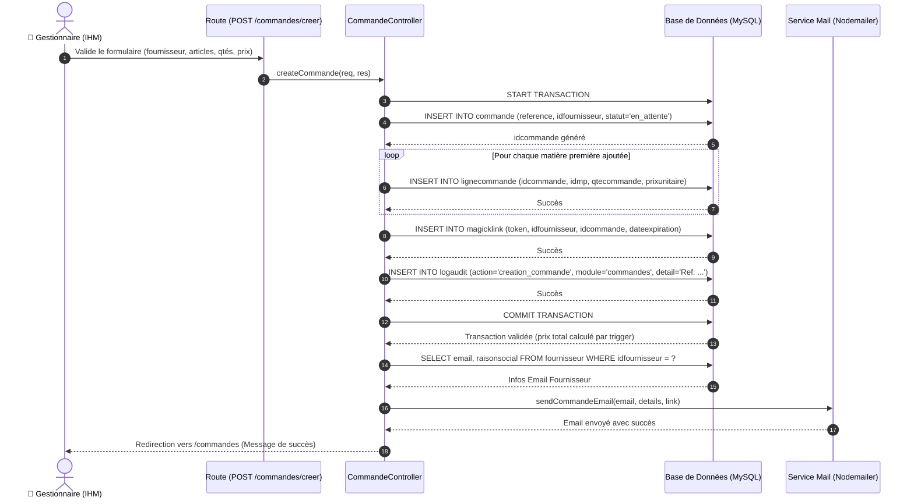
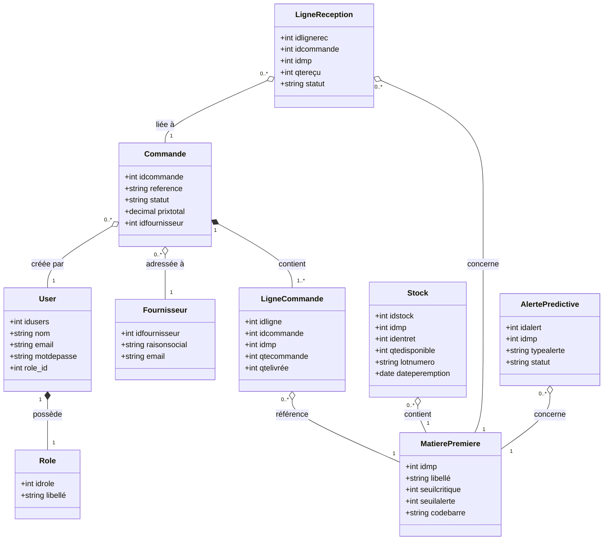

# Résumé de Présentation : BRALIMA Supply Chain
## Gestion Numérique de la Chaîne d'Approvisionnement des Matières Premières

Ce document constitue le support et le résumé pour votre présentation orale ou votre soutenance de projet. Il est structuré conformément à l'ordre proposé, avec des notes de présentation (speech) associées pour chaque partie.

---

## 1. Introduction

### 1.1. Contexte
* **La BRALIMA (Brasseries, Limonaderies et Malteries d'Afrique)** est le leader de l'industrie brassicole en République Démocratique du Congo (produisant des marques phares comme Primus, Mutzig, Turbo King, Vitalo, etc.).
* **Flux de matières premières** : La production nécessite un approvisionnement continu en matières premières critiques (malt, houblon, sucre, étiquettes, capsules, bouteilles).
* **Situation actuelle** : Les processus manuels de commande, la communication par e-mails informels ou appels, et l'absence de suivi des stocks en temps réel posent des risques constants de rupture de production ou de surstockage coûteux.

> **🎙️ Note Orale (Speech) :** 
> *"Bonjour à tous. Notre projet s'inscrit dans le cadre de la modernisation de la chaîne d'approvisionnement de la BRALIMA, une brasserie majeure en RDC. Face à des flux complexes de matières premières, la gestion manuelle traditionnelle montre ses limites et met en péril la continuité de la production. C'est pourquoi nous avons conçu une solution numérique intégrée."*

### 1.2. Problématique
* **La question centrale** : *Comment optimiser, sécuriser et automatiser le processus de commande et le suivi des stocks de matières premières de la BRALIMA afin de minimiser les ruptures de stock, garantir la traçabilité des lots et fluidifier la communication avec les fournisseurs tiers ?*
* **Sous-problèmes** :
  1. Manque de visibilité en temps réel sur les niveaux de stock par rapport aux seuils critiques.
  2. Difficulté pour les fournisseurs de suivre et de valider les commandes de manière sécurisée et rapide.
  3. Saisie manuelle laborieuse et sujette aux erreurs lors des réceptions de marchandises sur les quais.

> **🎙️ Note Orale (Speech) :**
> *"La problématique à laquelle répond notre solution est double : d'une part, le manque de visibilité en temps réel sur l'état des stocks par rapport aux besoins de production, et d'autre part, la lenteur et l'insécurité des échanges de commandes avec nos fournisseurs externes."*

### 1.3. Hypothèse
* **Notre hypothèse** : *L'implémentation d'une plateforme Web interactive multi-rôle, intégrant un système d'authentification sans mot de passe (Magic Link) pour les fournisseurs, des formulaires de réception optimisés pour les magasiniers, et un moteur d'alertes de stock en temps réel, permettra de réduire de 40% le cycle de commande et d'éliminer les erreurs d'inventaire, tout en assurant une traçabilité totale.*

> **🎙️ Note Orale (Speech) :**
> *"Nous posons l'hypothèse qu'en connectant directement le gestionnaire, le magasinier et le fournisseur sur une interface unique, sécurisée par Magic Link, nous pouvons automatiser et sécuriser l'approvisionnement de bout en bout avec des saisies fiables sur le terrain."*

### 1.4. Méthode et Techniques
* **Méthode d'Analyse et de Conception** : Utilisation de **l'UML (Unified Modeling Language)** pour la spécification rigoureuse des besoins (Cas d'utilisation) et la conception architecturale (Diagrammes de séquences, Diagrammes de classes).
* **Développement Agile / Incrémental** : Structuré en 3 itérations (IAM & Sécurité ➡️ Approvisionnements & Magic Links ➡️ Réception, Stocks & Alertes).
* **Techniques Clés** :
  * **RBAC (Role-Based Access Control)** : Séparation stricte des privilèges (Admin, Gestionnaire, Magasinier, Fournisseur).
  * **Magic Link** : Authentification par jeton unique temporaire envoyé par mail (pas de mot de passe à gérer pour le fournisseur externe).
  * **Intégrité Transactionnelle** : Transactions SQL (START TRANSACTION ... COMMIT) pour garantir qu'aucune action sur le stock ou les commandes ne soit validée partiellement en cas de panne réseau ou d'erreur.

> **🎙️ Note Orale (Speech) :**
> *"Pour ce faire, nous avons adopté une méthodologie d'analyse UML rigoureuse associée à un cycle de développement agile par itérations. Sur le plan technique, nous avons mis en œuvre un contrôle d'accès basé sur les rôles, des mécanismes d'authentification modernes comme le Magic Link, et une gestion de base de données transactionnelle stricte pour assurer la cohérence de nos flux de données."*

### 1.5. État de l'art
* **ERP Traditionnels (ex: SAP, Odoo)** : Très complets mais extrêmement coûteux, lourds à déployer localement et complexes à prendre en main pour les partenaires externes (fournisseurs).
* **Solutions "Maison" (Excel/E-mails)** : Gratuites au départ mais sources d'erreurs massives, de pertes d'informations et d'absence totale de sécurité ou d'audit.
* **Notre Positionnement** : Une solution Web sur mesure, légère, réactive et hautement sécurisée. Elle tire parti de l'écosystème Node.js/MySQL, facile à déployer en réseau local ou cloud, offrant une interface mobile intuitive pour le terrain.

> **🎙️ Note Orale (Speech) :**
> *"En analysant l'état de l'art, nous constatons que les grandes entreprises hésitent entre des ERP trop lourds et complexes à configurer et des tableurs Excel peu sécurisés. Notre solution se positionne comme un outil web sur mesure, léger et moderne, parfaitement adapté à l'infrastructure informatique de la BRALIMA."*

---

## 2. Modélisation

### 2.1. Diagramme de Cas d’Utilisation
Le diagramme suivant présente les acteurs du système (Administrateur, Gestionnaire Supply Chain, Magasinier, Fournisseur) et leurs interactions clés avec l'application.



> **🎙️ Note Orale (Speech) :**
> *"Notre modélisation commence par le diagramme de cas d'utilisation. Il met en évidence 4 rôles. L'Administrateur gère l'IAM et consulte les journaux d'audit. Le Gestionnaire crée les commandes et suit les stocks. Le Magasinier gère les réceptions sur le terrain. Enfin, le Fournisseur accède directement à ses commandes via une authentification simplifiée."*

### 2.2. Diagramme de Séquences
Ce diagramme détaille les échanges dynamiques lors d'un processus critique : la **création d'une commande d'approvisionnement** avec sécurisation transactionnelle et notification email du fournisseur.



> **🎙️ Note Orale (Speech) :**
> *"Pour illustrer le fonctionnement interne, voici le diagramme de séquence de création de commande. À la validation, le contrôleur lance une transaction MySQL. Il enregistre la commande, ses lignes associées, génère le token Magic Link, et écrit un log d'audit. Si toutes ces étapes réussissent, la transaction est validée en base (COMMIT) et un email automatique est envoyé au fournisseur."*

### 2.3. Diagramme de Classes
Le diagramme de classe physique ci-dessous structure l'architecture des données persistantes en base de données avec leurs cardinalités.



> **🎙️ Note Orale (Speech) :**
> *"Le diagramme de classes montre la modélisation statique de notre base de données. Chaque commande est liée à un fournisseur et contient des lignes de commande qui font référence aux matières premières. Les réceptions physiques sur le quai par le magasinier alimentent directement la table de stock et mettent à jour le statut des commandes."*

---

## 3. Implémentation

### 3.1. Outils et Technologies Utilisés

| Technologie / Outil | Rôle / Utilisation | Rationale (Pourquoi ce choix ?) |
| :--- | :--- | :--- |
| **Node.js / Express.js** | Framework Serveur (Backend) | Asynchrone, performant et très rapide pour mettre en place des APIs et des rendus web. |
| **MySQL (avec mysql2)** | Système de Gestion de Base de Données | Fiable, robuste, supportant nativement les transactions SQL complexes et les déclencheurs (Triggers). |
| **EJS (Embedded JS)** | Moteur de Templates (Frontend) | Intégration HTML/JS simple et dynamique, idéal pour un rendu rapide côté serveur. |
| **Tailwind CSS** | Framework de Styles (Design System) | Permet de concevoir rapidement une interface utilisateur responsive, moderne et épurée (Dark mode, design mobile). |
| **Bcrypt.js** | Hachage sécurisé des mots de passe | Assure que les mots de passe utilisateur ne sont jamais stockés en clair. |
| **Nodemailer** | Service de messagerie SMTP | Gère l'envoi automatisé des commandes et des liens de connexion Magic Link par email. |
| **Node-Cron** | Planificateur de tâches en arrière-plan | Permet de lancer automatiquement des vérifications quotidiennes (ex: relances automatiques de commandes). |
| **PDFKit** | Générateur de documents PDF | Permet au gestionnaire de télécharger instantanément des bons de commande officiels. |

> **🎙️ Note Orale (Speech) :**
> *"Pour concrétiser cette modélisation, nous avons choisi une stack technologique moderne et éprouvée. Le backend repose sur Node.js et Express. Le rendu des pages dynamiques se fait via EJS stylisé avec Tailwind CSS. La persistance est gérée par MySQL, sécurisée par des transactions SQL. Nous utilisons Nodemailer pour envoyer automatiquement les Magic Links pour la connexion sécurisée de nos fournisseurs."*

### 3.2. Architecture Logicielle (MVC)
L'application adopte une architecture en **couches Modèle-Vue-Contrôleur (MVC)** claire pour séparer les responsabilités :
* **Les Modèles (Models)** : Contiennent les requêtes SQL paramétrées (sécurisées contre les injections SQL) pour communiquer avec la base MySQL.
* **Les Vues (Views)** : Composées de gabarits `.ejs` gérant les formulaires, tableaux de bord interactifs et interfaces mobiles.
* **Les Contrôleurs (Controllers)** : Reçoivent les requêtes, valident les données d'entrée, orchestrent les transactions et retournent les réponses ou les rendus de vues.
* **Les Routes** : Dirigent les URLs vers les bons contrôleurs en appliquant les **Middlewares** de sécurité (ex : vérification de session et de rôle).

```
📂 PROJET BRALIMA
├── 📂 config (Connexion MySQL)
├── 📂 controllers (Logique métier - Auth, Commandes, Stock)
├── 📂 middleware (Contrôle d'accès RBAC)
├── 📂 models (Requêtes SQL persistantes)
├── 📂 public (Styles, Scripts client, images)
├── 📂 route (Aiguillage des URLs)
├── 📂 utils (Services mail, cron, helpers PDF, devises)
├── 📂 views (Interfaces utilisateurs EJS)
├── 📄 app.js (Point d'entrée de l'application)
└── 📄 package.json (Dépendances système)
```

> **🎙️ Note Orale (Speech) :**
> *"L'architecture logicielle respecte strictement le patron de conception MVC. Cela garantit la maintenabilité du code, où la couche de données MySQL est isolée de la logique de contrôle Express et des interfaces EJS présentées aux utilisateurs."*

### 3.3. Présentation des Modules de l'Application

L'application est découpée en 6 modules fonctionnels majeurs assurant la couverture complète des besoins logistiques :

1. **Module d'Authentification Sécurisée & IAM (Identity & Access Management)** :
   - *Description* : Gère la connexion des différents profils utilisateurs. Utilise des sessions Express sécurisées et le hachage des mots de passe avec Bcrypt pour les rôles internes.
   - *Innovation Magic Link* : Pour les partenaires externes (fournisseurs), ce module génère des jetons de connexion éphémères et uniques à usage limité (`magicklink`) envoyés par e-mail, dispensant le fournisseur de mémoriser ou gérer un mot de passe.
   - *Acteurs concernés* : Tous (Administrateur, Gestionnaire, Magasinier, Fournisseur).

2. **Module de Gestion des Commandes d'Approvisionnement** :
   - *Description* : Permet au Gestionnaire Supply Chain de concevoir des paniers de commande de matières premières. Le système calcule en temps réel le coût total (via des déclencheurs MySQL) selon des grilles tarifaires négociées.
   - *Flux de validation* : La commande passe par plusieurs statuts (`en_attente`, `approuvee`, `envoyee`, `livree`). Le fournisseur valide la date de livraison prévue directement depuis son portail Magic Link.
   - *Édition PDF* : Génère automatiquement des bons de commande officiels en PDF via la librairie `PDFKit`.
   - *Acteurs concernés* : Gestionnaire Supply Chain, Fournisseur.

3. **Module de Réception des Livraisons** :
   - *Description* : Fournit aux magasiniers une interface simplifiée et ergonomique pour enregistrer la livraison effective des marchandises sur les quais de la BRALIMA.
   - *Saisie et Validation* : Permet d'associer la réception à une commande approuvée, de saisir la quantité réellement reçue (gestion des livraisons partielles ou excédentaires) et de renseigner les données de traçabilité.
   - *Contrôle qualité* : Intègre la saisie obligatoire du numéro de lot fournisseur, du numéro de bon de livraison, du nom du chauffeur et de la date de péremption de la matière reçue avant sa mise en stock.
   - *Acteurs concernés* : Magasinier.

4. **Module de Gestion des Stocks & Mouvements Physiques** :
   - *Description* : Suit les quantités disponibles par matière première et par entrepôt ("Cuves", "Entrepôt principal").
   - *Journal immuable* : Chaque entrée, sortie, ajustement manuel d'inventaire ou transfert inter-entrepôt génère une ligne d'historique de mouvement (`mouvement_stock`) avec un delta de stock signé (ex: `+500kg`, `-20kg`), interdisant toute modification rétroactive frauduleuse.
   - *Acteurs concernés* : Magasinier, Gestionnaire Supply Chain.

5. **Module d'Alertes Prédictives & Tâches Planifiées (Cron)** :
   - *Description* : Moteur d'analyse statistique de la base de données.
   - *Prévention des ruptures* : Le système surveille en permanence la quantité disponible par rapport aux seuils d'alerte et de stock critique définis sur chaque fiche matière. Il génère automatiquement des alertes de priorité haute ou moyenne.
   - *Tâches de fond* : Un planificateur de tâches (`node-cron`) tourne toutes les 24 heures pour identifier les commandes en attente depuis plus d'un jour et envoyer des e-mails de relance automatique avec de nouveaux jetons d'accès.
   - *Acteurs concernés* : Gestionnaire Supply Chain.

6. **Module d'Administration & Audit de Sécurité** :
   - *Description* : Permet à l'Administrateur de gérer l'intégralité du personnel (création de comptes, suspension, attribution de rôles) et de surveiller l'état général du système.
   - *Journal d'audit* : Enregistre de manière exhaustive et immuable toutes les requêtes ou actions sensibles (ex: suppression de données, accès fournisseur, création de commandes) dans la table `logaudit` avec l'adresse IP de l'auteur et un détail au format JSON.
   - *Acteurs concernés* : Administrateur Système.

> **🎙️ Note Orale (Speech) :**
> *"L'application est structurée autour de six modules complémentaires. Le module IAM gère les accès des équipes et des partenaires via les Magic Links. Le module Commandes automatise la contractualisation avec l'aide d'éditions PDF. Le module Réception simplifie la saisie sur le quai grâce à des formulaires optimisés. Enfin, les modules Stock, Alertes et Audit assurent un suivi immuable des flux physiques et une sécurité d'accès de niveau industriel."*

### 3.4. Résultats
1. **Tableau de Bord en Temps Réel** : Visualisation globale et immédiate des KPIs de stock (stocks totaux, commandes en attente, alertes).
2. **Système de Commande Flop-Proof** : Cycle complet de commande opérationnel, du panier du gestionnaire à la validation du fournisseur via son **Magic Link**.
3. **Formulaire de Réception Optimisé** : Un magasinier peut enregistrer une livraison de lot en quelques secondes, avec saisie sécurisée des attributs du lot, du bon de livraison et des contrôles de conformité qualité.
4. **Alertes de Rupture Automatisées** : Le système surveille automatiquement les stocks et génère des alertes de type "seuil critique" ou "stock faible" directement visibles sur le dashboard du planificateur.
5. **Logs de Sécurité** : Journal d'audit centralisé enregistrant chaque action critique avec horodatage et adresse IP pour parer à toute malveillance.

> **🎙️ Note Orale (Speech) :**
> *"Les résultats de ce travail sont probants. Nous disposons d'un tableau de bord dynamique affichant les indicateurs clés de performance. Le flux d'approvisionnement est entièrement automatisé : le fournisseur reçoit son lien magique, valide la date de livraison, et le magasinier sur le quai valide la réception. Tout est historisé de manière immuable."*

### 3.5. Limites et Perspectives
* **Limites actuelles** :
  * La saisie des réceptions reste manuelle sur le quai de déchargement, ce qui dépend de la rigueur de l'opérateur.
  * Les alertes prédictives se limitent à des calculs de seuil statistique fixe en base de données.
  * La base de données est actuellement hébergée sur un serveur local sans réplication ni haute disponibilité.
* **Perspectives d'évolution** :
  * **Intégration de l'IA (Machine Learning)** : Utiliser des algorithmes de prévision de séries temporelles pour anticiper la demande en matières premières selon la saisonnalité (ex : hausse de la consommation de bière en fin d'année).
  * **Module de Lecture Automatique (OCR / Codes-barres)** : Développer ultérieurement une application mobile native (React Native ou Flutter) intégrant un scan de codes-barres ou une lecture automatique des bons de livraison par OCR pour accélérer la saisie.
  * **Intégration ERP** : Connecter la plateforme à l'ERP global de la BRALIMA pour synchroniser automatiquement les données comptables et de production.

> **🎙️ Note Orale (Speech) :**
> *"Bien que le système soit parfaitement opérationnel, nous en identifions les limites. La saisie des réceptions reste manuelle sur le terrain. De plus, nos alertes de stock reposent sur des seuils fixes. En perspective, nous prévoyons d'ajouter à l'avenir un module de lecture automatique par codes-barres ou OCR et d'intégrer des modèles d'intelligence artificielle pour analyser la consommation historique et prédire plus finement les dates de réapprovisionnement."*

---

## 4. Conclusion

* **Réussite technique** : La solution développée répond exactement au cahier des charges de la BRALIMA en simplifiant le cycle d'approvisionnement tout en le sécurisant.
* **Gain d'efficacité** : Grâce à la centralisation des flux, aux notifications automatiques et au suivi des réceptions en temps réel, le temps administratif consacré aux commandes et les erreurs d'inventaire sont drastiquement réduits.
* **Valeur académique et professionnelle** : Ce projet démontre l'importance d'allier une modélisation rigoureuse (UML) à des choix technologiques légers et modernes (Node.js/Express/MySQL) pour délivrer des applications à forte valeur ajoutée en entreprise.

> **🎙️ Note Orale (Speech) :**
> *"En conclusion, ce projet de gestion de la chaîne d'approvisionnement de la BRALIMA démontre l'impact de la numérisation des processus logistiques. Nous avons réussi à livrer une application complète, sécurisée et fonctionnelle, jetant les bases d'une logistique plus intelligente et intégrée. Je vous remercie pour votre attention et je suis maintenant ouvert à vos questions."*
